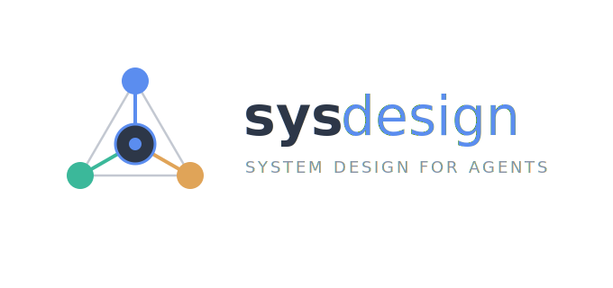
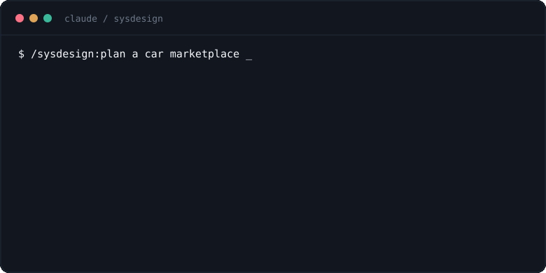

<p align="center">
  
</p>

<p align="center">
  <a href="https://github.com/mkabumattar/sysdesign/releases"></a>
  <a href="https://github.com/mkabumattar/sysdesign/actions/workflows/validate.yml"></a>
  <a href="https://github.com/mkabumattar/sysdesign/blob/main/LICENSE"></a>
  <a href="#install"></a>
  
  
  
  
  <a href="https://sysdesign.mkabumattar.com"></a>
</p>

# sysdesign

**System design knowledge, wired into your AI agent.** A [Claude Code](https://claude.com/claude-code) plugin: one skill, thirteen commands, and seventeen self-contained reference files. Explain a concept, compare options, pressure-test an architecture, estimate capacity, or prep an interview — with tradeoffs stated, not hand-waved.

The knowledge lives in the files. There are **no external links inside the skill** — the agent loads the one reference a task needs, and the answer is right there. Original prose, inspired by the taxonomy of [ByteByteGo's *System Design 101*](https://github.com/ByteByteGoHq/system-design-101), never copied from it.

```text
$ /sysdesign:compare REST vs GraphQL vs gRPC
constraint? public API · mixed clients · cacheable
  REST     HTTP caching, broad support          ✓ default
  GraphQL  one round trip, client picks fields   cost: caching, N+1
  gRPC     low-latency service-to-service        cost: not browser-native
› recommend REST. move off it only when a concrete pain justifies the cost.
```

---

## Install

In **Claude Code**, run these two prompts:

```
/plugin marketplace add mkabumattar/sysdesign
```

```
/plugin install sysdesign@sysdesign
```

Then `/reload-plugins` to apply. Try it:

```
/sysdesign:help
/sysdesign:explain consistent hashing
/sysdesign:compare REST vs GraphQL vs gRPC
/sysdesign:review my checkout: gateway -> monolith -> single Postgres
/sysdesign:estimate a URL shortener at 100M new links/day
/sysdesign:interview design a news feed
```

Or just talk — the `system-design` skill activates on architecture/design questions without a command.

## Update

When a new version ships:

```
/plugin update sysdesign
```

```
/reload-plugins
```

See the [CHANGELOG](CHANGELOG.md) for what changed in each release.

## The method

Every answer follows the same three moves:

1. **State the constraint** — traffic pattern, consistency need, latency budget, team reality. No numbers? Assume out loud.
2. **Pick the option that fits** — reuse before build, managed before self-hosted, boring before novel.
3. **Name what you gave up** — every choice costs something: consistency, ops burden, latency, money.

Validation at trust boundaries, data-loss handling, auth, and observability are never dropped to "keep it simple."

## What `/plan` does

The flagship command doesn't guess. It runs a short interview first, one system area per round, then writes a complete plan into a `.sysdesign-<project>/` folder in your repo.

<p align="center">
  
</p>

```text
$ /sysdesign:plan a car marketplace
▸ round 1/9  product & scope     dealers + private sellers? on-platform payments?
▸ round 2/9  users & scale       ~2M listings, 10M MAU, read-heavy
▸ round 3/9  data & consistency  strong on reservations, eventual on search
   … auth · payments · media & search · infra · reliability …
! conflict: 99.95% everywhere vs a team of 8. which wins?
✓ requirements locked → writing .sysdesign-carbazaar/PLAN.md + requirements.md
✓ validation round: confirm the design, resolve anything residual
```

It never invents a requirement, pushes back when your answers conflict, and closes by validating the finished design. For an existing system reach for `/sysdesign:evolve`; to look something up, `/sysdesign:find`.

## Commands

Thirteen thin wrappers over the one `system-design` skill, so the reasoning stays consistent.

| Command | What it does |
| --- | --- |
| `/sysdesign:plan <system>` | Design end to end — a full multi-round interview, then a complete plan |
| `/sysdesign:evolve <current → goal>` | Evolve/migrate an existing system with a rollback-safe path |
| `/sysdesign:explain <concept>` | Explain a concept with tradeoffs and when to use it |
| `/sysdesign:find <term>` | Search the references and surface the covering sections |
| `/sysdesign:compare <a> vs <b>` | Compare options, recommend one for your constraint |
| `/sysdesign:review <architecture>` | Pressure-test a design for SPOFs and missing safeguards |
| `/sysdesign:choose <component>` | Pick a DB / queue / cache / deploy strategy under constraints |
| `/sysdesign:estimate <system>` | Back-of-envelope capacity: QPS, storage, bandwidth, memory |
| `/sysdesign:tradeoffs <choice>` | Name what a design choice gains and gives up |
| `/sysdesign:diagram <system>` | Sketch the architecture as a Mermaid / ASCII diagram |
| `/sysdesign:interview <problem\|topic>` | Run interview prep with the 7-step framework |
| `/sysdesign:cheatsheet <area>` | Condense an area into a scannable cheatsheet |
| `/sysdesign:help` | List commands and reference topics |

## Reference topics

Seventeen standalone files under `skills/system-design/references/` — dense, tradeoff-first, no external links:

`api-web` · `data-storage` · `caching-performance` · `distributed-systems` · `security-auth` · `devops-k8s` · `observability` · `cost-engineering` · `architecture-patterns` · `low-level-design` · `case-studies` · `networking` · `os-concurrency` · `payments` · `ai-ml-systems` · `dev-tools` · `interview`

Together they cover the fifteen categories of *System Design 101* — API & web, databases & storage, caching & performance, cloud & distributed systems, security, DevOps/CI-CD, software architecture, real-world case studies, technical interviews, computer fundamentals (networking + OS), payments & fintech, AI/ML, and dev tools.

## Why it's different

- **Self-contained.** Zero external links inside `skills/`. A reader never has to click out.
- **Tradeoff-first.** No option is named without the constraint it fits and the cost it carries.
- **License-clean.** Original prose. MIT. Never reproduces *System Design 101*'s text or images.
- **Works offline.** Plain Markdown and two JSON manifests. No build, no runtime, no telemetry.

## Artifacts & export

Beyond the skill, the repo ships shareable, **generic** outputs (nothing project- or vendor-specific):

- `artifacts/diagrams/*.mmd` — original Mermaid sources (OAuth flow, sharding, caching layers, deploy strategies, request lifecycle, payments).
- `scripts/export.py` — a self-contained [uv](https://docs.astral.sh/uv/) script that bundles the reference files into a numbered Markdown / PDF / docx set:

```bash
uv run scripts/export.py        # → dist/ (git-ignored)
```

## Layout

```
sysdesign/
  .claude-plugin/        marketplace.json · plugin.json (icon wired)
  skills/system-design/  SKILL.md (router) + references/*.md (the knowledge)
  commands/              one .md per /sysdesign:<verb>
  scripts/               validate.sh (CI checks) · export.py (uv bundle builder)
  artifacts/             generic Mermaid diagrams + index
  assets/                logo, icon, favicons, per-command glyphs
  site/                  Astro landing page for sysdesign.mkabumattar.com
  .github/               CoC · contributing · security · issue templates · CI
```

## Develop

No compiler — validation is one script (the source of truth CI runs):

```bash
bash scripts/validate.sh
```

It checks: manifests parse and versions match, zero external links in `skills/`, every reference file is mapped in `SKILL.md`, and frontmatter is present. See [CONTRIBUTING](.github/CONTRIBUTING.md) and, for the editorial system, [DESIGN.md](DESIGN.md).

What's next lives in the [ROADMAP](ROADMAP.md) — one 1–2 day increment at a time.

## Maintainer

Built by **[Mohammad Abu Mattar](https://mkabumattar.com)** — Cloud & DevOps Manager, ~8 years across full-stack, backend, and platform engineering. sysdesign distills that tradeoff-first habit into a reference an agent can read.

More: [mkabumattar.com](https://mkabumattar.com) · [GitHub](https://github.com/mkabumattar) · [QuenchWorks](https://quench-works.com) (free, 0-CVE hardened image & chart catalog)

## License

[MIT](LICENSE) for this repository's original content. Topic taxonomy inspired by ByteByteGo's *System Design 101* (CC BY-NC-ND 4.0) — no text or images from it are reproduced here.
