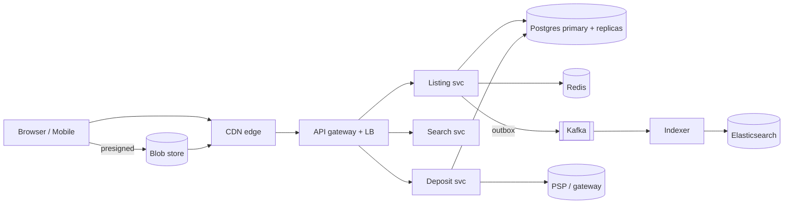

# Example plan — used-car marketplace (on-platform checkout, multi-region)

A worked `/sysdesign:plan` output, showing the target depth: concrete, grounded in the
interview answers and real numbers, one section per the plan template. This is illustrative —
a real run would derive every number from the user's own `AskUserQuestion` answers and write to
`.sysdesign-carbazaar/PLAN.md` (with `requirements.md`) at the repo root.

> **Locked from the interview:** global marketplace, sellers list used cars with photos, buyers
> search/filter/browse and **pay a deposit on-platform** to reserve; ~10M active listings;
> multi-region (US + EU + MENA); read-heavy (~100:1); strong consistency only on the money path.

## 1. Requirements (locked)

- **Functional:** listing CRUD (+ up to 20 photos), search/filter/sort, listing detail, seller
  contact, on-platform **reservation deposit** (hold → capture/refund), reviews.
- **Non-functional:** search p95 < 300 ms; 99.95% availability; deposits **exactly-once** and
  auditable; photos served from edge.
- **Out of scope (v1):** full vehicle purchase/financing, live auctions, chat.
- **Non-negotiables:** input validation at the edge, no data loss on the money path, authz per
  request, metrics/logs/traces on every service.

## 2. Capacity estimate

- 5M DAU × 20 searches = 100M searches/day ≈ **1.2k QPS avg, ~6k peak** (×5).
- Listings: 10M active; 100k new/day ≈ 1.2/s; 300k edits/day ≈ 3.5/s. Writes are tiny.
- Photos: 10M × 12 avg × 1.5 MB ≈ **180 TB** original; +derivatives ≈ **~250 TB** in blob.
- Photo egress: 100M detail views/day × 6 photos × 200 KB ≈ **120 TB/day** → CDN is the budget.
- Deposits: ~50k/day ≈ <1/s — trivial volume, but must be **correct**.
- **Bottleneck: read + image egress.** The money path is small; spend the budget on CDN, blob,
  search, and cache — not on write scale.

## 3. Data model

- **Postgres (source of truth):** `users`, `listings` (fk seller, specs, price, status,
  region), `photos` (fk listing, blob key, order), `deposits` (fk listing/buyer, state,
  idempotency_key), `ledger_entries` (append-only, double-entry), `reviews`.
- **Elasticsearch:** denormalized listing docs for search/facets (kept in sync via CDC).
- **Redis:** hot listing cache, search-result cache, rate-limit counters, deposit idempotency.
- **Blob (S3-class):** original + derivative photos. Retention: soft-delete listings 90 days.

## 4. API surface (REST, `/v1`)

- `GET /v1/listings?q=&make=&price_lte=&region=&cursor=` — cursor pagination, cache-friendly.
- `GET /v1/listings/{id}` · `POST/PATCH/DELETE /v1/listings` (seller, authz'd).
- `POST /v1/listings/{id}/photos` — presigned upload URLs.
- `POST /v1/listings/{id}/deposit` — **Idempotency-Key required**; authorize the hold.
- `POST /v1/deposits/{id}/capture|refund` — state machine, ledger-backed.
- Auth on every write; reads are public + rate-limited at the gateway.

## 5. High-level architecture

Critical read path: CDN → gateway → search/listing → Redis → Postgres replica. Writes publish to
Kafka via the **outbox**; the indexer updates Elasticsearch asynchronously.

## 6. Component choices

| Constraint | Option | What it costs |
|---|---|---|
| Relational data + money txns, ~100 GB | **Postgres** (primary + read replicas) | write SPOF (mitigated: hot standby + failover) |
| Search + facets at 6k QPS | **Elasticsearch** (as index, not source of truth) | eventual consistency, sync pipeline to own |
| Hot reads, sessions, idempotency | **Redis** | another tier; cache invalidation |
| DB→search sync without dual writes | **Kafka + outbox + CDC** | ops overhead, lag (seconds) |
| 250 TB photos, 120 TB/day egress | **Blob + CDN** | vendor cost; invalidation strategy |
| Deploy | **Kubernetes**, rolling + canary | cluster ops (managed control plane) |

## 7. Money path (deposits)

Authorize a hold via the PSP (idempotency key), record a pending `ledger_entry`; on reservation
success **capture**, else **refund**. The ledger is append-only, double-entry, reconciled daily
against the PSP. Exactly-once = at-least-once PSP calls + idempotency keys + a dedup table.
**PCI:** never store PANs — tokenize at the PSP; the platform only holds tokens.

## 8. Security & auth

OAuth 2.0 (Authorization Code + PKCE); short access tokens + refresh; sessions for the web app.
RBAC (buyer/seller/admin); authz enforced per request against server-side identity — never trust
a client-supplied `seller_id`. TLS everywhere; secrets in a manager (not images); WAF + rate
limits at the edge.

## 9. Caching & performance

CDN for photos + cacheable listing detail. Redis cache-aside for hot listings (TTL 60 s) and
search results (TTL 30 s, keyed by normalized query) with jittered TTLs + single-flight to avoid
stampede. Latency budget: edge < 50 ms, API < 150 ms, search < 300 ms p95. Order of attack:
reduce round trips → index → cache → replicas → precompute facets.

## 10. Search & media

Elasticsearch with facets on make/model/price/year/region; typeahead on make+model. Photos:
presigned direct-to-blob upload → async transcode (thumb/detail/full WebP) via a queue → CDN.

## 11. Deployment & regions

3 regions (US, EU, MENA). Postgres primary per region with the listing data **partitioned by
region** (a car is local); Elasticsearch + Redis + CDN per region. Deploy on Kubernetes, rolling
with a canary stage; GitOps (ArgoCD); Terraform IaC. **DR:** cross-region read replica, RPO ≤ 1
min, RTO ≤ 15 min via promote-standby.

## 12. Reliability & observability

SLOs: search p95 < 300 ms, 99.95% availability, deposit success > 99.9%. Timeouts + retries with
backoff/jitter on every call; circuit breakers around the PSP and Elasticsearch; bounded queues
(backpressure); idempotency on all retried writes. Metrics (Prometheus/Grafana), logs (Loki),
traces (OpenTelemetry); alert on RED/USE symptoms, not internal blips. SLOs → error budgets.

## 13. Tradeoff ledger

- **Single Postgres primary per region (no sharding):** gained txns, joins, simple ops; gave up
  write scale-out — fine, writes are ~4/s. Flip if writes exceed a few k/s.
- **Elasticsearch as index (not source of truth):** gained fast facets; gave up read-after-write
  on search (seconds of lag) — acceptable for listings.
- **Region-partitioned data:** gained locality + isolation; gave up easy cross-region search
  (federate when a user searches "any country").

## 14. Risks & what would change the design

- Write QPS × 100 (auctions added) → shard listings or move hot tables to a write-scalable store.
- Global (cross-region) search demand → a federated/global search tier over the regional indexes.
- Full on-platform *purchase* (not just deposits) → escrow, KYC, payouts, and a much larger ledger.
- CDN egress cost dominating → tiered image quality, better cache headers, regional origins.
